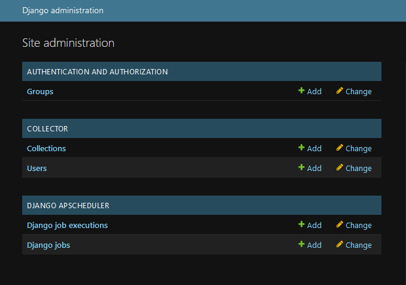

# CashCollector


Cash Collection application with a restful backend and mobile and web as front ends.

The CashCollector has a list of tasks where he/she goes to a customer and collects cash from, indicating the customer's info. i.e. name, address, amount_due (currency), amount_due_at (datetime), etc…

The CashCollector can see only one task at a time (the next task only) (They may however have read-only access to the tasks that he/she has already done)

The CashCollector should deliver the collected cash to the Manager.

The CashCollector has the freedom to go to the Manager whenever he/she wants to.

The CashCollector should able to deliver any number or all of tasks when they are delivering.

However, as a business we are afraid that the CashCollector will abuse the system and never deliver the amount they collected, thus we need to mark him/her as frozen if he/she has an amount greater than 5000USD for a period longer than 2 Days.

If the cash collector has 5000USD or more for 2 days or more, we should flag their account as frozen


### Dependencies

```
- Python v3.11.4

- Django rest frame work v5.0.7

- Swagger

```

### Installation

1. create virtual environment , pip install virtualenv , python -m venv env_name
2. Activate virtual environment , env_name\Scripts\Activate   
3. pip install -r requirements.txt
4. In terminal , python manage.py makemigrations
5. In terminal , python manage.py makemigrations
6. In ternminal , run python manage.py runserver


### APIs 

1. user-tasks/ to GET the list of the tasks that have been done by the CashCollector.
2. user-next_task/ to GET the task that CashCollector should do now.
3. user-status/ to GET a flag indicating whether the CashCollector is frozen or not.
4. collect/ to POST the amount collected for which task
5. pay/ to POST the amount delivered to the Manager
6. check-status/ to GET status after making validation for the CashCollector  
7. all-users-status  / to GET status after making validation for all CashCollectors 


### SWAGGER

- navigate to => http://127.0.0.1:8000/swagger/


### Admin 

- navigate to => http://127.0.0.1:8000/admin/
- Admin
- Admin@123 



### JOB

-scheduler.py run job every 1 hr to update the status of cash collector [ Notice 2 days should pass after the `CashCollector` has a balance greater than 5000USD]

## Testing

- run in terminal "pytest" to run all test scenarios in tests folder